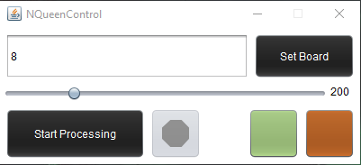
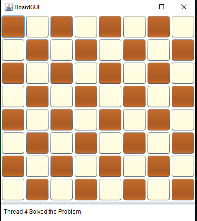
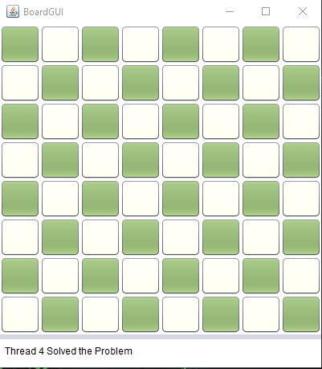
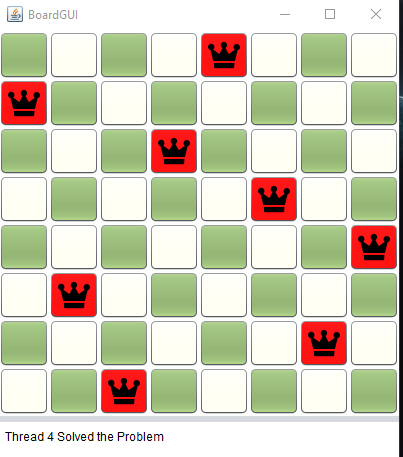

# N-Queens Solver with GUI

This project is a Java desktop application that visualizes the **N-Queens Problem** solution using **multithreading**. It includes a **graphical interface** to display the board dynamically as the algorithm finds a solution.

## Features

- Solves the **N-Queens problem** using **backtracking**.
- Utilizes **multithreading** to explore multiple starting points.
- **Graphical representation** of the chessboard.
- Allows users to set **board size** and **update speed** dynamically.
- Supports **custom board colors**.

## Technologies Used

- **Java (Swing & AWT)** for GUI.
- **Multithreading** for concurrent computation.
- **Backtracking Algorithm** for solving the problem.

## How It Works

1. The user sets the board size (default: **8x8**).
2. The algorithm places queens one by one, ensuring **no two queens attack each other**.
3. The board updates dynamically as the algorithm progresses.
4. Once a solution is found, all other threads are terminated.

## Installation & Running

1. **Clone the repository** or download the project files.
2. Compile the Java files:

   ```sh
   javac NQueens.java BoardGUI.java NQueenControl.java
   ```

3. Run the application:

   ```sh
   java NQueenControl
   ```

## Screenshots





